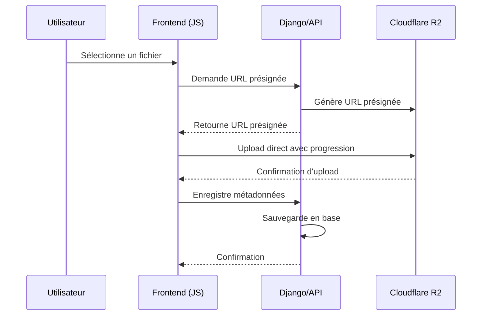

# Upload Direct vers Cloudflare R2

Cette documentation explique comment fonctionne l'upload direct des vidéos et photos vers Cloudflare R2 sans faire transiter les fichiers par le serveur Django.

## Fonctionnement

### Architecture

1. **Formulaire HTML** - Interface utilisateur avec barre de progression
2. **JavaScript** - Gère l'upload direct vers R2 avec suivi de progression
3. **API Django** - Génère les URLs présignées et enregistre les métadonnées
4. **Cloudflare R2** - Stockage direct des fichiers volumineux

### Flux d'Upload



## Implémentation

### Backend (Django)

#### Modèles mis à jour

**Video model** (`core/models.py`):
```python
class Video(models.Model):
    title = models.CharField(max_length=255)
    cover_film = models.ImageField(upload_to='films/')
    description = models.TextField(blank=True, null=True)
    video = models.FileField(upload_to='videos/film/', blank=True, null=True)  # Backward compatibility
    video_url = models.URLField(blank=True, null=True)  # R2 direct URL
    file_key = models.CharField(max_length=500, blank=True, null=True)  # R2 file key
    # ... autres champs
```

**Photo model** (`core/models.py`):
```python
class Photo(models.Model):
    title = models.CharField(max_length=255, blank=True, null=True)
    image = models.ImageField(upload_to='photos/gallery/', blank=True, null=True)  # Backward compatibility
    image_url = models.URLField(blank=True, null=True)  # R2 direct URL
    file_key = models.CharField(max_length=500, blank=True, null=True)  # R2 file key
    # ... autres champs
```

#### Vues API

**Génération d'URL présignée** (`core/views.py`):
```python
@require_http_methods(["GET"])
@login_required
def generate_presigned_url(request):
    """
    Génère une URL présignée pour l'upload direct vers Cloudflare R2
    """
    filename = request.GET.get('filename')
    content_type = request.GET.get('type', 'video')  # 'video' ou 'photo'
    
    # Génère une clé unique pour le fichier
    file_extension = os.path.splitext(filename)[1]
    folder = 'videos' if content_type == 'video' else 'photos'
    unique_key = f"{folder}/{uuid.uuid4()}{file_extension}"
    
    # Crée l'URL présignée
    r2_client = get_r2_client()
    presigned_url = r2_client.generate_presigned_url(
        'put_object',
        Params={'Bucket': settings.AWS_STORAGE_BUCKET_NAME, 'Key': unique_key},
        ExpiresIn=3600,  # 1 heure
        HttpMethod='PUT'
    )
    
    # Construit l'URL publique
    public_url = f"https://{settings.AWS_S3_CUSTOM_DOMAIN}/{unique_key}"
    
    return JsonResponse({
        'presigned_url': presigned_url,
        'file_key': unique_key,
        'public_url': public_url
    })
```

**Enregistrement des métadonnées** (`core/views.py`):
```python
@require_http_methods(["POST"])
@login_required
@csrf_exempt
def save_video_metadata(request):
    """
    Enregistre les métadonnées après l'upload réussi vers R2
    """
    data = json.loads(request.body)
    title = data.get('title')
    description = data.get('description')
    file_key = data.get('file_key')
    public_url = data.get('public_url')
    
    # Sauvegarde en base de données
    video = Video.objects.create(
        title=title,
        description=description,
        video_url=public_url,
        file_key=file_key
    )
    
    return JsonResponse({
        'success': True,
        'video_id': video.id
    })
```

### Frontend (HTML + JavaScript)

#### Formulaire de vidéo (`core/templates/administa/video_form.html`)

**HTML pour l'upload**:
```html
<div class="space-y-2">
    <label class="block text-sm font-semibold text-gray-700">Fichier vidéo</label>
    <div class="mt-1 flex justify-center px-6 pt-5 pb-6 border-2 border-gray-300 border-dashed rounded-lg">
        <div class="space-y-1 text-center">
            <input type="file" name="video" id="videoFileInput" class="sr-only">
            <!-- ... -->
        </div>
    </div>
</div>

<!-- Barre de progression -->
<div id="uploadProgress" class="hidden">
    <div class="flex justify-between text-sm font-medium text-gray-700 mb-2">
        <span id="progressStatus">Initialisation...</span>
        <span id="progressText">0%</span>
    </div>
    <div class="w-full bg-gray-200 rounded-full h-3">
        <div id="progressBar" class="bg-gradient-to-r from-indigo-500 to-purple-600 h-3 rounded-full" style="width: 0%"></div>
    </div>
    <div class="flex justify-between text-xs text-gray-500 mt-2">
        <span id="progressSpeed">0 MB/s</span>
        <span id="progressTimeRemaining">--</span>
    </div>
    <div class="text-center text-sm text-gray-600" id="progressDetails"></div>
</div>
```

**JavaScript pour l'upload direct**:
```javascript
async function uploadVideoToR2(file) {
    // 1. Obtenir l'URL présignée
    const presignedResponse = await fetch(`/api/generate-presigned-url/?filename=${encodeURIComponent(file.name)}&type=video`);
    const presignedData = await presignedResponse.json();
    
    // 2. Upload direct avec suivi de progression
    const xhr = new XMLHttpRequest();
    
    xhr.upload.addEventListener('progress', function(event) {
        if (event.lengthComputable) {
            const percentComplete = Math.round((event.loaded / event.total) * 100);
            const loadedMB = (event.loaded / (1024 * 1024)).toFixed(2);
            const totalMB = (event.total / (1024 * 1024)).toFixed(2);
            
            // Mise à jour de l'interface
            document.getElementById('progressBar').style.width = percentComplete + '%';
            document.getElementById('progressText').textContent = percentComplete + '%';
            document.getElementById('progressSpeed').textContent = speedMBs + ' MB/s';
            document.getElementById('progressDetails').textContent = loadedMB + ' / ' + totalMB + ' MB';
        }
    });
    
    // 3. Envoi de la requête
    xhr.open('PUT', presignedData.presigned_url, true);
    xhr.setRequestHeader('Content-Type', file.type);
    xhr.send(file);
    
    // 4. Enregistrement des métadonnées une fois terminé
    xhr.addEventListener('load', async function() {
        if (xhr.status === 200) {
            // Enregistrement des métadonnées
            const metadataResponse = await fetch('/api/save-video-metadata/', {
                method: 'POST',
                headers: {
                    'Content-Type': 'application/json',
                    'X-CSRFToken': getCSRFToken()
                },
                body: JSON.stringify({
                    title: title,
                    description: description,
                    file_key: presignedData.file_key,
                    public_url: presignedData.public_url
                })
            });
        }
    });
}
```

## Avantages

### Performance
- **Aucune charge serveur** pendant l'upload des fichiers volumineux
- **Support illimité de la taille** des fichiers (pas de limite RAM)
- **Bande passante optimisée** - pas de double transfert
- **Progression en temps réel** avec vitesse et temps restant

### Sécurité
- **URLs présignées à durée limitée** (1 heure par défaut)
- **Authentification requise** pour générer les URLs
- **Protection CSRF** sur toutes les requêtes
- **Validation des métadonnées** côté serveur

### Expérience utilisateur
- **Barre de progression détaillée** avec pourcentage, vitesse et temps restant
- **Feedback immédiat** sur le statut de l'opération
- **Gestion des erreurs** avec messages clairs
- **Responsive** sur tous les appareils

## Configuration requise

### Variables d'environnement
```bash
# Cloudflare R2
R2_ACCESS_KEY_ID=votre_access_key
R2_SECRET_ACCESS_KEY=votre_secret_key
R2_BUCKET_NAME=votre_bucket
R2_ENDPOINT_URL=https://votre_compte.r2.cloudflarestorage.com
R2_CDN_DOMAIN=votre_domaine_cdn (optionnel)
```

### Dépendances
```bash
pip install boto3
```

## Personnalisation

### Durée d'expiration des URLs
Modifier le paramètre `ExpiresIn` dans la fonction `generate_presigned_url`:
```python
presigned_url = r2_client.generate_presigned_url(
    'put_object',
    Params={'Bucket': settings.AWS_STORAGE_BUCKET_NAME, 'Key': unique_key},
    ExpiresIn=7200,  # 2 heures
    HttpMethod='PUT'
)
```

### Types de fichiers autorisés
Modifier l'attribut `accept` dans les champs fichiers:
```html
<input type="file" name="video" accept="video/*">
<input type="file" name="image" accept="image/*">
```

## Dépannage

### Problèmes courants

1. **Erreurs d'authentification R2**
   - Vérifier les variables d'environnement
   - S'assurer que les clés ont les bons droits (putObject, getObject)

2. **Erreurs CORS**
   - Configurer les en-têtes CORS sur le bucket R2
   - Autoriser l'origine de votre application

3. **URL expirées**
   - Réduire la taille des fichiers ou augmenter la durée d'expiration

### Logs utiles

```bash
# Vérifier les logs Django
tail -f debug.log

# Vérifier les logs R2 (dans le tableau de bord Cloudflare)
```

## Maintenance

### Surveillance
- Vérifier régulièrement les logs d'erreurs
- Surveiller l'espace utilisé sur le bucket R2
- Tester périodiquement la fonctionnalité avec des fichiers de test

### Mises à jour
Lors de mises à jour du système :
1. Vérifier la compatibilité des bibliothèques `boto3`
2. Tester l'authentification R2
3. Valider le fonctionnement des URLs présignées